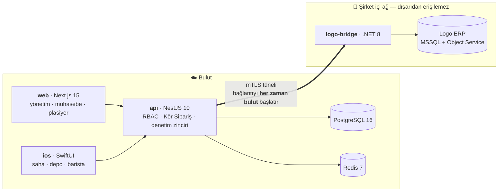

# ToptanPortal

**HoReCa tedarikçileri için B2B sipariş portalı — şirket içindeki Logo ERP ile çift yönlü, internete kapalı entegrasyon.**


Otel, restoran ve kafelere tedarik yapan toptancılar, siparişi hâlâ telefon ve WhatsApp'tan alır; fiyat, stok ve cari bakiye ERP'de kilitlidir. Bu portal o üç veriyi bayiye 7/24 açar: bayi kendi matris fiyatıyla sipariş verir, ekstresini görür, borcunu kartla öder — ve sipariş, muhasebecinin elini hiç değdirmeden Logo ERP'ye düşer.

Tek kiracılı bir demo değil, gerçek bir kurulumun gerektirdiklerine göre yazıldı: rol bazlı yetki, değiştirilemez denetim kaydı (5651/5070), KVKK alan şifrelemesi, 10 yıllık e-Belge arşivi (VUK 253) ve saha ekibi için çevrimdışı çalışan bir iOS uygulaması.

---

## Mimari



```
apps/
  api/          NestJS 10 · REST API · RBAC · Kör Sipariş kalkanı · yasal delil loglaması
                (Logo'yu hem okur hem yazar: katalog ve fiyat çift yönlüdür)
  web/          Next.js 15 · yönetim, muhasebe ve plasiyer arayüzü
  ios/          SwiftUI · barista, depo ve saha uygulaması
  logo-bridge/  .NET 8 · şirket içi (on-prem) Logo köprüsü — mTLS ile bağlanır
packages/
  contracts/    Roller, yetkiler, Zod şemaları · web ve API'nin ortak sözleşmesi
  db/           Prisma şeması, sertleştirme betikleri, denetim zinciri doğrulayıcı
```

**Neden ayrı bir köprü servisi:** Logo ERP sunucusu asla genel internete açılmaz. Bulut tarafındaki API, şirket içindeki köprüye yalnızca karşılıklı sertifika doğrulaması (mTLS) yapılan bir tünel üzerinden erişir; köprü de yerel ağdaki MSSQL ve Logo Object Service ile konuşur.

---

## Öne çıkan mühendislik kararları

Her biri aşağıda gerekçesiyle anlatılıyor; buradakiler projenin karakterini belirleyen kararlar.

| Karar | Özet |
|---|---|
| [**Kör Sipariş Modu**](#kör-sipariş-modu) | Fiyat görmemesi gereken kullanıcıda parasal alanlar **maskelenmez, sunucuda silinir** — `0.00` yazmak bile veri modelini sızdırır. Aynı kural e-postada ve şablon motorunda da geçerli. |
| [**Değiştirilemez denetim zinciri**](#yasal-delil-loglaması-5651--5070) | `hash(n) = SHA256(hash(n-1) ‖ kanonikJSON(kayıt))`. `UPDATE`/`DELETE`/`TRUNCATE` **veritabanı tetikleyicisiyle** engellenir; finansal işlem ile log yazımı aynı transaction'dadır — log yazılamıyorsa işlem de olmaz. |
| [**mTLS köprü**](#logo-erp-entegrasyon-katmanı) | Şirket içi ağda dışarıya açık uç yok; bağlantıyı her zaman bulut başlatır. Köprü buluta hiç çağrı yapmaz. |
| [**Kart verisi hiç dokunmaz**](#sanal-pos-3d-secure-ve-dbs) | 3D Secure yönlendirmesi; portal yalnızca maskeli kartı ve banka sonucunu görür. PCI-DSS kapsamı dışında kalmanın tek güvenilir yolu veriyi hiç görmemektir. |
| [**Alan sahipliği modeli**](#katalog-yönetimi-ve-fiyat-değişikliği-portal--logo) | Portal ve Logo aynı kartı yazabildiği için "çakışırsa hangisi doğru" sorusu tek bayrakla değil, **alan bazında sahiplikle** çözülür; köken değişmez. |
| [**KVKK alan şifrelemesi**](#kvkk) | Kişisel alanlar AES-256-GCM ile şifreli (`*_enc`), arama HMAC-SHA256 blind index ile (`*_idx`); şifreli metne anahtar kimliği gömülü, rotasyonda eski kayıt yeniden şifrelenmeden okunur. |
| [**Çevrimdışı iOS kuyruğu**](#ios-uygulaması) | Depo bodrumda, soğuk hava deposunda sinyal yok. Sipariş/tahsilat/ziyaret diske atomik yazılır; idempotency anahtarı ve gövde **oluşturulurken** donar. |

Bu kararların ortak yanı şu: kurallar mümkün olan her yerde **uygulama katmanının altına** indirilmiştir — veritabanı tetikleyicisi, kısıt ve şema. Uygulamadaki bir kontrol, yeni bir sorguyla veya doğrudan bağlanan bir araçla atlanabilir.

---

<!-- EKRAN GÖRÜNTÜLERİ — dosyaları docs/screenshots/ altına koyup bu bloğu yorumdan çıkarın.
## Ekran görüntüleri

| Sipariş ekranı | Cari ekstre | Denetim kaydı |
|---|---|---|
|  |  |  |

| Katalog yönetimi | Entegrasyon durumu | iOS saha ekranı |
|---|---|---|
|  |  |  |

---
-->

## İçindekiler

- [Kurulum](#kurulum) · [Tohum verisi hesapları](#tohum-verisi-hesapları)
- **Yetki ve güvenlik** — [RBAC](#rol-tabanlı-yetkilendirme-rbac) · [Kör Sipariş Modu](#kör-sipariş-modu) · [Kimlik doğrulama](#kimlik-doğrulama) · [Denetim zinciri](#yasal-delil-loglaması-5651--5070) · [KVKK](#kvkk) · [Kullanıcı yönetimi](#kullanıcı-yönetimi)
- **Ticari akışlar** — [Toplu sipariş](#toplu-sipariş-excel--yapıştırma) · [Katalog ve fiyat](#katalog-yönetimi-ve-fiyat-değişikliği-portal--logo) · [Cari hesap ve tahsilat](#cari-hesap-ekstre-ve-tahsilat) · [Saha yönetimi](#saha-yönetimi--portföy-ziyaret-hedef)
- **Belge ve ödeme** — [e-Fatura arşivi](#e-belge-arsivi) · [Sanal POS ve DBS](#sanal-pos-3d-secure-ve-dbs) · [e-Belge üretim hattı](#e-belge-üretim-hattı)
- **Entegrasyon** — [Logo ERP katmanı](#logo-erp-entegrasyon-katmanı) · [Bildirim](#bildirim-e-posta-ve-mobil) · [Bildirim metinleri](#bildirim-metinleri-kiracı-şablonları)
- **Diğer** — [Bilinen ödünler](#bilinen-ödünler) · [iOS uygulaması](#ios-uygulaması) · [Sıradaki modüller](#sıradaki-modüller) · [CI](#sürekli-tümleştirme) · [Komutlar](#komutlar)

---

## Kurulum

Gereksinimler: Node.js 20.11+, pnpm 9+, Docker.

```bash
pnpm install
cp .env.example .env          # anahtarları doldurun (aşağıya bakın)
pnpm infra:up                 # PostgreSQL 16 + Redis 7
pnpm db:migrate               # şema + sertleştirme
pnpm db:seed                  # geliştirme kullanıcıları
pnpm dev:api                  # http://localhost:3001  (dokümantasyon: /api/docs)
pnpm dev:web                  # http://localhost:3000
```

### Anahtar üretimi

```bash
openssl rand -base64 64   # JWT_ACCESS_SECRET
openssl rand -base64 32   # FIELD_ENCRYPTION_KEYS içindeki anahtar (32 bayt olmalı)
openssl rand -base64 32   # BLIND_INDEX_KEY
```

Uygulama, üretim ortamında `CHANGE_ME` içeren bir anahtarla veya IP beyaz listesi kapalıyken **açılmaz**. Yanlış yapılandırmayla ayakta kalmak, hiç ayağa kalkmamaktan risklidir.

### Tohum verisi hesapları

Ortak şifre: `Toptan2026!Portal` (`SEED_PASSWORD` ile değiştirilebilir)

| E-posta | Rol | Not |
|---|---|---|
| `admin@toptanportal.local` | Süper Admin | 2FA zorunlu · yalnızca `127.0.0.1` / `::1` |
| `plasiyer@toptanportal.local` | Satış Temsilcisi | İki bayiye atanmış |
| `sahip@mavikapi.local` | İşletme Ana Yetkilisi | 2FA zorunlu |
| `barista@mavikapi.local` | İşletme Alt Yetkilisi | **Kör Sipariş Modu** |
| `muhasebe@mavikapi.local` | İşletme Muhasebecisi | 2FA zorunlu · sipariş veremez |

---

## Uygulanmış modüller

### Rol tabanlı yetkilendirme (RBAC)

Kararlar rol üzerinden değil **yetki** üzerinden verilir (`packages/contracts/src/permissions.ts`). Rol türevleri eklendiğinde denetleyici kodu değişmez.

| Rol | Fiyat | Bakiye | Sipariş | Evrak |
|---|---|---|---|---|
| Süper Admin | ✓ | ✓ | görüntüler / iptal eder | ✓ |
| Satış Temsilcisi | ✓ | ✓ | bayi adına girer | — |
| İşletme Ana Yetkilisi | ✓ | ✓ | girer / onaylar | ✓ |
| İşletme Alt Yetkilisi | — | — | **yalnızca onaya gönderir** | — |
| İşletme Muhasebecisi | ✓ | ✓ | **giremez** | ✓ |

### Kör Sipariş Modu

İşletme Alt Yetkilisi hesabında API yanıtlarındaki tüm parasal alanlar sunucu tarafında **silinir** — maskelenmez.

Neden silme: `0.00` veya `***` yazmak alanın varlığını ve dolayısıyla veri modelini sızdırır; ayrıca istemcide yanlışlıkla render edilme riski doğurur. Silme, sızıntı yüzeyini sıfırlar.

Alan sözlüğü `packages/contracts/src/blind-order.ts` içindedir ve hem API hem istemciler aynı listeyi kullanır. Süzgeç son savunma hattıdır; servis katmanı zaten yetkisiz alanları sorgulamamalıdır. Davranış `apps/api/src/common/interceptors/blind-order.interceptor.spec.ts` ile kilitlenmiştir — katalog yanıtına sözlüğe eklenmemiş yeni bir finansal alan girdiğinde testin kırılması beklenir.

### Kimlik doğrulama

- **Erişim jetonu:** 15 dk, imzalı JWT, rol ve oturum kimliği taşır
- **Yenileme jetonu:** 30 gün, opak rastgele değer; veritabanında yalnızca SHA-256 özeti tutulur
- **Rotasyon + yeniden kullanım tespiti:** iptal edilmiş bir yenileme jetonu tekrar sunulursa o giriş zincirindeki tüm oturumlar iptal edilir
- **2FA (TOTP):** Süper Admin, İşletme Ana Yetkilisi ve Muhasebeci için zorunlu; kurtarma kodları Argon2id ile özetlenir
- **Cihaz bağlama:** yenileme jetonu başka bir cihazda kullanılamaz
- **IP beyaz listesi:** Süper Admin için CIDR eşleşmesi; hem girişte hem her istekte denetlenir
- **Argon2id** (m=19 MiB, t=2, p=1) ve bilinmeyen e-postalarda da ödenen sahte doğrulama maliyeti — kullanıcı sayımını (enumeration) engeller

### Yasal delil loglaması (5651 / 5070)

```
hash(n) = SHA256( hash(n-1) || "." || kanonikJSON(kayıt(n)) )
```

- Kiracı başına boşluksuz `seq` sırası; eş zamanlı yazımlar `pg_advisory_xact_lock` ile serileştirilir
- `audit_logs` tablosunda `UPDATE`, `DELETE` ve `TRUNCATE` veritabanı tetikleyicisiyle **engellenir** — uygulama kullanıcısı dahil kimse geçmişi değiştiremez
- Finansal aksiyonlarda log yazımı iş verisiyle **aynı işlemde** yapılır: log yazılamıyorsa işlem de tamamlanmaz
- Zincir denetimi: `pnpm --filter @toptanportal/db verify-audit` (günlük cron ve delil sunumu öncesi çalıştırılır)
- Sorgulama ekranı: `/panel/denetim` (yalnızca Süper Admin). Üst şeritte zincirin son halkası (sıra numarası + özet) durur — delil sunan kişi, ekrandaki kayıtların hangi zincir noktasına kadar doğrulandığını bilmelidir. Ekran bir **gözetim** aracı değil delil sunum aracıdır; yetkinin dar tutulmasının sebebi budur.

### KVKK

- Telefon gibi kişisel alanlar AES-256-GCM ile şifreli tutulur (`*_enc`), arama için HMAC-SHA256 blind index kullanılır (`*_idx`)
- Şifreli metne anahtar kimliği gömülüdür; anahtar rotasyonunda eski kayıtlar yeniden şifrelenmeden okunur
- Denetim kaydı `payload` alanı; şifre, jeton, TOTP anahtarı ve kart verisi gibi alanları yazmadan önce maskeler

### Kullanıcı yönetimi

Ekran `/panel/kullanicilar`. İşletme ana yetkilisi yalnızca kendi işletmesinin kullanıcılarını yönetir (`USER_MANAGE_COMPANY`), Süper Admin tümünü (`USER_MANAGE_ALL`). Kapsam sorguya girer, sonradan süzülmez.

- **Yetki yükseltme engellenir:** kimse kendi rolünden geniş yetkili bir rol açamaz. İşletme yetkilisi toptancı tarafı rollerini (Süper Admin, Plasiyer) açabilseydi kendine bir plasiyer hesabı açıp *tüm* bayilerin portföyünü görürdü — bu, rol sisteminin tamamını anlamsız kılar.
- **Geçici şifreyi sunucu üretir.** Yöneticinin belirlediği bir şifre, kullanıcının şifresini bilen ikinci bir kişi demektir; o hesapla yapılan işlemin kime ait olduğu tartışmalı hale gelir ve denetim kaydının delil değeri düşer.
- **Askıya alma açık oturumları da kapatır.** Yalnızca durumu değiştirmek, erişimi jeton süresi dolana kadar sürdürürdü — işten çıkarılan bir kullanıcı için bu süre çok uzundur.
- **Harcama limiti kullanıcı bazındadır** ve işletmenin risk limitinden ayrıdır: bir barista sipariş verebilir ama 50.000 TL'lik sipariş veremez.

### Toplu sipariş (Excel / yapıştırma)

Ekran `/panel/toplu-siparis`, uç `POST /cart/bulk-import`. Bayilerin çoğu sipariş listesini hâlâ Excel'de tutar; bu akış portalin benimsenmesini çalışma alışkanlığının değişmesine bağlı olmaktan çıkarır. Hem dosya sürükleme hem doğrudan yapıştırma desteklenir — kullanıcıların çoğu hücreleri kopyalar, dosyayı kaydetmez.

- **Ayraç** noktalı virgül, virgül veya sekme olabilir; birim dosyada taşınmaz, ürünün sipariş birimi (genelde koli) varsayılır.
- **`1.250` bin iki yüz ellidir.** Bir virgül iki yüz elli okumak siparişi 1000 kat küçültür ve bunu kimse dosyayı yüklerken fark etmez. Ayrımı son ayraçtan sonraki hane sayısı belirler: iki veya daha az hane → ondalık, fazlası → binlik.
- **Başlık satırı sessizce atlanır** (`Stok Kodu;Adet` yazan satır kullanıcının hatası değil alışkanlığıdır); okunamayan *diğer* satırlar satır numarasıyla raporlanır.
- **Aynı kod iki satırda geçiyorsa miktarlar toplanır.** Son satırı kazanan bir mantık, siparişin bir kısmını sessizce düşürürdü.
- Sonuç raporu eksiksizdir: kaç satır okundu, kaçı sepete girdi, hangileri eşleşmedi. "37 kalem eklendi" demek yetmez — kullanıcı 40 satır yüklediğini bilir ve eksiği aramak zorunda kalmamalıdır.
- Kurallar `apps/api/src/cart/bulk-import.service.spec.ts` ile kilitlenmiştir.

### Katalog yönetimi ve fiyat değişikliği (portal → Logo)

Portal Logo'yu yalnızca okumaz: ürün kartı açar ve fiyat değiştirir. Ekranlar `/panel/katalog-yonetimi` (`CATALOG_MANAGE`) ve `/panel/fiyat-listeleri` (`PRICE_LIST_MANAGE` görür, `PRICE_CHANGE` değiştirir).

İki sistemin aynı alanı yazabildiği her yerde "çakıştıklarında hangisi doğru" sorusu doğar. Cevap tek bir bayrakla verilemez, çünkü bir stok kartının farklı alanlarının doğal sahibi farklıdır — bu yüzden sahiplik yazılıdır (`packages/contracts/src/catalog-write.schema.ts`):

- **Sunum alanları** (açıklama, görsel, kategori, sıralama, sipariş sınırları) her zaman **portalindir**; Logo bunları zaten tutmaz ve senkron onlara dokunmaz.
- **Kimlik alanları** (ad, birim seti, KDV oranı) kartın **kökenine** göre sahiplenilir. Logo'da açılmış bir kartın adını portalden değiştirmek, muhasebecinin defterinde gördüğü adı haberi olmadan değiştirmektir.
- **Stok ve muhasebe alanları** her koşulda **Logo'nundur**.

Köken (`LOGO` / `PORTAL`) **değişmez**: portalden güncellenen bir Logo kartı portalin malı olmaz. Değişebilir bir köken, sahiplik kuralını her güncellemede yeniden tanımlar ve kural olmaktan çıkar.

- **Stok kodu değiştirilemez** (veritabanı tetikleyicisi). Kodu değiştirmek, Logo'da yeni kart açıp eskisini sahipsiz bırakmakla aynı şeydir: geçmiş hareket, fatura ve sipariş eski kodda kalır, portal başka kartı gösterir. Yanlış kod girildiyse kart arşivlenir, yenisi açılır.
- **Yazım kuyruktan geçer**, doğrudan çağrıyla değil. Kullanıcının kart açma işlemi köprünün o andaki erişilebilirliğine bağlı olmamalıdır; erişilemediği için başarısız olan bir kayıt "kaydedilmedi" der ve o kişi aynı kartı baştan girer.
- **Yazım durumu ekranda görünür** (`SYNCED` / `PENDING` / `FAILED`). Bu işaret olmasaydı kullanıcı yeni fiyatı görüp işinin bittiğini sanardı; fark ancak fatura kesildikten sonra anlaşılırdı. Dördüncü bir "bilinmiyor" durumu yoktur — operatör o durumda ne yapacağını bilemez.
- **Kart taslak doğar ve yayına Logo yazımından sonra alınır.** Önce yayına alıp sonra yazmak, Logo'da olmayan bir ürünü satışa açmaktır. Kısıt veritabanındadır: Logo referansı olmayan portal kartı `PUBLISHED` olamaz.
- **Senkron, portalde bekleyen değişikliğin üstüne yazmaz** (`apps/api/src/integration/catalog-ownership.ts`). Kuyrukta bekleyen bir fiyat varsa Logo'dan gelen değer o değişiklikten öncesine aittir; üstüne yazmak kullanıcının değişikliğini o daha ekrandan ayrılmadan geri alır. Reddedilmiş satırın üstüne de yazılmaz — ayrışma düzeltilene kadar **görünür** kalmalıdır.
- **Toplu fiyat güncelleme yoktur.** Bir ekrandan yüzlerce fiyatı birden değiştirmek, yanlış bir yüzdeyi tüm katalogda uygulamayı bir tıklık hale getirir ve geri alınması Logo'da elle düzeltme gerektirir. Toplu iş gerektiğinde doğru araç Logo'nun kendi ekranıdır; oradan yapılan değişiklik zaten senkronla portale gelir.
- **Fiyat değişikliğinde gerekçe zorunludur** ve denetim kaydına **eski değerle birlikte** yazılır. Altı ay sonra "bana neden bu fiyattan kesildi" sorusu geldiğinde yeni değeri görmek yetmez; eski değer üzerine yazılmıştır ve başka hiçbir yerde durmaz.
- `PRICE_CHANGE`, `PRICE_LIST_MANAGE`'den **ayrı** bir yetkidir: ikincisi fiyatı görmeyi açar, birincisi kesilecek faturayı değiştirir. Var olan bir yetkinin anlamını genişletmek, onu taşıyan herkese haberi olmadan yeni bir güç vermektir.

### Cari hesap, ekstre ve tahsilat

- **Bakiye hareketlerden yeniden hesaplanır.** `companies` tablosundaki bakiye alanları yalnızca sipariş risk kalkanının hızlı okuması için tazelenen bir önbellektir; ekstre ve özet her zaman hareketlerden türetilir.
- **Yürüyen bakiye SQL pencere fonksiyonuyla üretilir.** Uygulamada toplamak sayfalamayla bağdaşmaz: ikinci sayfa dönem başı devrini kaybeder ve sessizce yanlış bakiye gösterir.
- **Yaşlandırma kova sınırları sabittir** (`Vadesi Gelmemiş`, `1-30`, `31-60`, `61-90`, `90+`) ve kiracı bazında değiştirilemez — muhasebe raporlaması karşılaştırılabilir kalmalıdır.
- **Tahsilat yöntemi onay ihtiyacını belirler:** kredi kartı ve DBS doğrudan işlenir; nakit, çek ve senet fiziksel teslim gerektirdiği için `PENDING` doğar ve kaydı giren kişi kendi kaydını onaylayamaz.
- **Dağıtım varsayılan olarak FIFO'dur:** vadesi en eski açık belgeden başlanır, dağıtılamayan kısım avans olarak kalır.
- Ekstre `Excel (CSV) İndir` düğmesiyle dışa aktarılır. Dosya **noktalı virgülle** ayrılır ve **BOM** ile başlar (Türkçe Excel virgülü ondalık ayracı sayar, BOM'suz UTF-8'i yerel kod sayfasıyla okur); `=`, `+`, `-`, `@` ile başlayan hücreler formül enjeksiyonuna karşı etkisizleştirilir. Kurallar `apps/web/src/lib/ekstre-csv.spec.ts` ile kilitlenmiştir.

### Saha yönetimi — portföy, ziyaret, hedef

- **Plasiyer yalnızca kendisine atanmış bayileri görür.** Kapsam `SalesRepAssignment` üzerinden sunucuda çizilir; istemcinin gönderdiği hiçbir süzgeç kapsamı *genişletemez*. Portföy ticari bir sınırdır.
- **Ziyaret notu silinemez ve metni değiştirilemez** (veritabanı tetikleyicisi). Bir şikâyet kaydının sonradan yok olması, müşteri ilişkisinin geçmişini yeniden yazmaktır; düzeltme yeni bir notla yapılır. Takip tarihi değiştirilebilir — o bir *plandır*, kayıt değil.
- **Prim iki şarta bağlıdır:** ciro yalnızca onaylanmış siparişlerden sayılır *ve* prim tahsil edilen tutar oranında ödenir. Primi ciro üzerinden ödemek, plasiyeri ödeme gücü olmayan bayiye satmaya teşvik eder.
- Ciro, plasiyerin **portföyündeki** bayilerin siparişlerinden gelir — siparişi kimin girdiğinden değil. Aksi hâlde portalin benimsenmesi plasiyerin çıkarına aykırı olurdu.
- Gerçekleşen ciro önbelleklenmez; her okumada hesaplanır.

<a id="e-belge-arsivi"></a>
### e-Fatura / e-İrsaliye arşivi

**PDF asıl belge değildir.** Hukuki asıl, UBL-TR 1.2 biçimindeki imzalı XML'dir; PDF ondan türetilmiş görüntüleme kopyasıdır. İhtilafta mahkemeye XML sunulur, bu yüzden arşiv XML üzerine kurulur ve ikisi çelişirse doğru olan XML'dir.

- **Belgeler veritabanında değil, nesne deposunda durur.** Tabloda yalnızca yol ve SHA-256 özeti vardır — 10 yıllık XML'i veritabanında taşımak felaket kurtarmayı saatlerden günlere çıkarır.
- **Silme yoktur** (VUK 253: 10 yıl saklama). Silme ve tutar değişikliği **veritabanı tetikleyicisiyle** engellenir; uygulama katmanındaki bir kontrol, yeni bir sorguyla veya doğrudan bağlanan bir araçla atlanabilir. Yalnızca *durum* ilerleyebilir — tutar düzeltmesi iade faturasıyla yapılır.
- **`ACCEPTED` ile `DELIVERED` ayrıdır.** e-Fatura'da alıcının reddetme hakkı vardır; ikisini tek duruma indirmek reddedilmiş bir faturayı tahsil edilebilir göstermek olur.
- **İndirme iki adımlıdır:** oturumlu istek kısa ömürlü *imzalı* bağlantı alır, tarayıcı o bağlantıya gider. Bağlantı indiren kişiyi içinde taşır; erişim kaydı bu sayede oturumsuz uçtan da yazılır ve `e_document_access` tablosu append-only'dir.
- **Belge yolu her okumada köke göre çözülür**; dışarı taşan istek reddedilir (`apps/api/src/einvoice/document-storage.service.spec.ts`).
- Toplu indirmede tek bir zip üretilmez — 500 belgeyi bellekte paketlemek eş zamanlı iki talepte sunucuyu tüketir; ayrı bağlantılar tarayıcının indirme yöneticisine devredilir.

### Sanal POS (3D Secure) ve DBS

**Kart verisi portale hiç ulaşmaz.** Kullanıcı bankanın 3D sayfasına yönlendirilir ve kartını oraya girer; portalin gördüğü tek şey bankanın döndüğü sonuç ve maskeli karttır (`454671******7894`). Kart verisi sunucudan bir kez geçerse o sunucu logları, yedekleri ve bellek dökümleriyle birlikte PCI-DSS kapsamına girer — kapsam dışında kalmanın tek güvenilir yolu veriyi hiç görmemektir.

- **Geri dönüş ucunda oturum yoktur** (`POST /pos/callback/:tenantCode`, `@Public()`); banka jeton taşıyamaz. Kimlik doğrulamasının yerini mağaza anahtarıyla hesaplanan **özet** alır ve özeti tutmayan yanıt hiçbir kaydı değiştirmez, yalnızca denetim izi bırakır.
- **Tutar her zaman veritabanından okunur.** Bankadan dönen parametreler kullanıcının tarayıcısından geçer; oradaki tutara güvenmek 1 TL ödeyip 10.000 TL'lik borç kapatmanın yoludur.
- **Başarı için iki koşul birlikte aranır:** 3D doğrulaması (`mdStatus`) *ve* banka provizyonu (`Response`). Yalnızca birine bakmak, parası çekilmemiş bir işlemi başarılı saymaktır. Kural `apps/api/src/pos/pos-provider.spec.ts` ile kilitlenmiştir.
- **`NEEDS_REVIEW`**: banka onayladı ama portal tahsilatı yazamadıysa işlem başarısız sayılmaz, insan incelemesine düşer ve kullanıcıya açıkça "yeniden ödeme yapmayın" denir.
- POS yapılandırması **ya tamamdır ya da yoktur**; yarım yapılandırmayla uygulama açılmaz.

**DBS:** vadesi gelen açık belgeler borç dosyası olarak bankaya verilir, banka sonuç dosyası döner. Tutarlar **kuruş** olarak yazılır — ondalık ayracı bankadan bankaya değişir ve yanlış yorumlanan bir ayraç 1.234,56 TL'yi 123.456 TL yapar. Aynı belge açık bir DBS kaydında yalnızca bir kez bulunabilir (kısmi benzersiz indeks): aynı faturayı iki dosyaya koymak bayiden iki kez tahsilat demektir ve geri dönüşü portalin düzeltebileceği bir şey değildir.

### Bildirim (e-posta ve mobil)

Bildirim teknik bir ayrıntı değil **ticari bir sözdür**: "siparişiniz onaylandı" mesajı gitmezse bayi telefona sarılır ve portalin çözdüğü iş operatörün masasına döner. Bu yüzden bildirim, gönderilip gönderilmediği **sorulabilir** bir kayıttır — gönder-ve-unut bir yan etki değil. Ekranlar: `/panel/bildirimler` (tercihler, herkese açık), `/panel/bildirim-kaydi` (gönderim kaydı, `NOTIFICATION_LOG_VIEW`).

- **İşlemsel ileti ile ticari ileti aynı borudan geçmez.** Kampanya iletisi 6563 sayılı kanun gereği İYS izni ister; sipariş bildirimi istemez. Bu modül ticari ileti göndermez — ikisini birleştirmek, izinsiz gönderimi bir yapılandırma hatası kadar yakın hale getirirdi.
- **Kuyruk outbox'tan ayrıdır.** Outbox siparişin Logo'ya ulaşmasını garanti eder; orada biriken bir e-posta hatası sipariş aktarımını geciktirir. Muhasebe sisteminin beklemesi ile bir hatırlatmanın gecikmesi aynı ağırlıkta değildir.
- **Kayıt iş verisiyle aynı işlemde yazılır, gönderim kuyruktan yapılır.** Sağlayıcıya yapılan bir HTTP çağrısı sipariş işlemini posta sunucusunun yanıt süresine bağlar ve kilitleri uzatır.
- **İçerik kuyruğa yazılırken üretilir ve donar.** Gönderim anında yeniden üretmek, aradan geçen sürede değişen bir tutarla (iade faturası, kısmi iptal) kullanıcının bildirilmiş olması gerekenden başka bir mesaj göndermek olurdu. Gönderilmiş kaydın metni ve alıcısı **veritabanı tetikleyicisiyle** kilitlidir.
- **Kör Sipariş Modu posta kutusunda da geçerlidir.** Arayüzde özenle gizlenen tutarın e-postayla sızması gizlemeyi bastan anlamsız kılar; metin alıcının rolüne göre üretilir ve parasal konular (tahsilat, vade) `BALANCE_VIEW` yetkisi olmayana **hiç üretilmez** — "vadesi geçen belgeniz var" cümlesi tek başına da ticari bilgidir. Kural `apps/api/src/notification/notification-template.spec.ts` ile kilitlenmiştir.
- **Güvenlik ve onay bekleyen sipariş konuları kapatılamaz.** Hesabı ele geçirilen kullanıcının bunu öğrenmesinin tek yolu güvenlik bildirimidir ve saldırganın ilk işi onu kapatmak olurdu; onay bildirimi kapatıldığında ise zarar kullanıcıya değil, siparişi bekleyen bayiye olur (bekleyen siparişin stoğu rezervedir).
- **Geçersiz adres kalıcı hatadır** ve deneme hakkını tüketmeden kapatılır: altı kez denemek sağlayıcı nezdinde gönderen itibarını düşürür ve *geçerli* adreslere giden mesajları da istenmeyen klasörüne iter. Geçici hata (ağ, 5xx, 429) üstel geri çekilmeyle tekrarlanır.
- **Gönderilmeyen kayıt da yazılır.** "Bu bayiye vade hatırlatması gitti mi?" sorusunun cevabı "hayır, tercihi kapalıydı" olabilir; cevapsız kalamaz.
- **Vade hatırlatması belge başına değil bayi başına** üretilir (dört ayrı e-posta, hatırlatmayı spam'e çevirir ve bir sonrakini okunmadan sildirir), günde bir kez gönderilir ve yerel saat 09:00–20:00 dışına ertelenir. Bloke bayiye otomatik hatırlatma gitmez — blokaj insan kararıdır ve yürüyen bir görüşme vardır.
- **Mobil jeton kayıtta durmaz:** kuyrukta SHA-256 özeti tutulur, gerçek jeton gönderim anında cihaz kaydından çözülür; cihaz iptal edilmişse mesaj gönderilmez.
- Üretimde `MAIL_API_URL` / `MAIL_API_KEY` / `MAIL_FROM` eksikse uygulama **açılmaz**. Bildirim gönderemeyen bir portal, güvenlik uyarısını da gönderemez.

### Bildirim metinleri (kiracı şablonları)

Varsayılan metinler kodda durur; kiracı yalnızca **üzerine yazar** ve satırı silmek varsayılana döner. Ekran: `/panel/bildirim-metinleri` (`NOTIFICATION_TEMPLATE_MANAGE`).

- **Şablon motoru kasıtlı olarak aptaldır.** Koşul, döngü, işlev yoktur; yalnızca `{{değişken}}` yerine değer konur. Kullanıcının düzenlediği bir metne mantık taşımak, o mantığın hatasını gönderilmiş bir iletide ortaya çıkarır — geri alınamayan tek işlemde.
- **Kör Sipariş Modu bu katmanda da geçerlidir ve mekanizması şudur:** parasal değişken, görmeye yetkisi olmayan alıcı için **üretilmez**; değeri olmayan bir değişkeni içeren **satırın tamamı düşürülür**. Kiracı "Sipariş tutarı: {{tutar}}" yazsa bile o satır kör moddaki alıcıya gitmez. Değişkeni boş dizeyle değiştirmek "Sipariş tutarı:" gibi yarım bir satır bırakırdı; yarım satır, gizlenen şeyin varlığını yine de ele verir.
- **Konu satırına parasal değer, kör moda ulaşan konularda konulamaz.** Sipariş durumu ve onay bildirimi fiyat görmeyen kullanıcıya da gider; konudaki bir değişken düşürülemez, konunun tamamını varsayılana döndürür — yani şablonu yazan kişi yazdığından başka bir konu satırı göndermiş olur. Tahsilat ve vade konularında bu kısıt yoktur: o bildirimler `BALANCE_VIEW` olmayan alıcıya zaten hiç üretilmez. Kural hem Zod şemasında hem **veritabanı kısıtında** durur.
- **Tanınmayan değişken kaydetme anında reddedilir.** Yazım hatası (`{{tutari}}`) sessizce kabul edilseydi, satır düşürme kuralı yüzünden o satır hiç görünmez ve eksik ancak gerçek bir bildirim gittikten sonra fark edilirdi.
- **Önizleme iki sürümlüdür ve kaydetmez.** Yetkili alıcının ve Kör Sipariş Modundaki alıcının göreceği metin yan yana durur; kural bir açıklama cümlesi değil, **görülen** bir şeydir. Önce kaydedip sonra görmek, hatalı bir metnin yürürlükte kaldığı bir aralık bırakır.
- **Şablon değişikliği geçmişe işlemez.** İçerik kuyruğa yazılırken donar; sonradan değişen bir metin, gönderilmiş bir iletinin kaydını değiştirmez — aksi halde "biz size böyle yazmıştık" cümlesi doğrulanamaz olurdu. Değişikliğin kendisi denetim kaydına **metniyle birlikte** yazılır.
- Gönderim yolunda şablonlar **önbellekten** okunur (60 sn). Kayıt iş verisiyle aynı işlemde yazıldığı için her satırda bir sorgu, sipariş işlemini uzatır ve kilitleri bekletir.

### e-Belge üretim hattı

Portal GİB'e **doğrudan bağlanmaz**: mali mühür ve GİB kanalı özel entegratörde kalır. Mührün özel anahtarını bir web uygulamasının sürecine koymak, o sürecin her açığını imza yetkisine çevirirdi — imzalanmış fatura ise geri alınamaz. Uç: `POST /e-documents/issue` (`EDOCUMENT_ISSUE`), sipariş ayrıntı ekranından tetiklenir.

- **Belge siparişten üretilir.** Serbest kalemli fatura portalin işi değildir; aksi halde aynı fatura Logo'da ve portalde farklı tutarlarla var olabilir ve hangisinin doğru olduğu sorusu mutabakat masasına kalırdı. Yalnızca **onaylanmış** siparişten kesilir.
- **Aritmetik belgenin içinde tutarlı olmalıdır.** Belge toplamları veritabanındaki tutarlardan kopyalanmaz, **yuvarlanmış satırlardan hesaplanır**; sonuç portalin bildiği toplamla bir kuruştan fazla ayrılırsa belge **hiç üretilmez**. İki farklı toplam taşıyan bir fatura, muhasebede saatlerce aranan bir farktır.
- **KDV matrahları orana göre gruplanır.** Tek bir toplam KDV satırı, farklı oranlardan oluşan bir faturada hangi matrahın hangi oranla vergilendiğini gizler.
- **Geçersiz belge üretilmez.** Belge numarası biçimi, VKN/TCKN ve satır aritmetiği üretimden **önce** denetlenir: reddi entegratörden öğrenmek, o noktada belge numarasının tükenmiş olması demektir ve tükenmiş numara defterde açıklanması gereken bir satır olarak durur.
- **Kesme ile gönderme ayrıdır.** Belge kesilir, arşive yazılır ve `DRAFT` kalır; entegratöre iletim bakım görevinden yapılır. Kullanıcının isteğini entegratörün yanıt süresine bağlamak, zaman aşımında belgenin kesilip kesilmediğini bilinemez kılardı.
- **Dosya kayıttan önce yazılır.** Kayıt önce yazılıp dosya yazımı başarısız olsaydı, veritabanı "belge var" derken arşiv boş kalırdı ve bu ancak aylar sonra, indirme denendiğinde fark edilirdi. Ters sırada en kötü ihtimalle sahipsiz bir dosya kalır — hiçbir kaydın işaret etmediği, kimseyi yanıltmayan bir dosya. `write` var olan dosyanın **üzerine yazmaz**.
- **Gönderim ETTN üzerinden idempotenttir** ve geçici hatada belge `DRAFT` kalır; deneme hakkı **tükenmez**. Bildirimden farklı olarak burada vazgeçmek yanlıştır: kesilmiş bir fatura defterde durur, "denemekten vazgeçtik" diyebileceğimiz bir belge yoktur.
- **Durum sorularak takip edilir, bildirim beklenerek değil.** Entegratörün geri bildirimi kaybolabilir; sorgu cevapsız kalmaz. Tanınmayan durum kodu **iyimser yorumlanmaz** — belge olduğu yerde kalır ve tekrar sorulur.
- **Gönderim öncesi arşiv bütünlüğü doğrulanır:** dosyanın özeti kayıttakiyle uyuşmuyorsa belge gönderilmez. Değişmiş bir belgeyi imzalatmak, portalin kendi kaydından farklı bir faturayı hukuki asıl yapmaktır.
- **e-İrsaliye tutar taşımaz.** İrsaliyeye tutar yazmak, malı teslim eden depo görevlisinin ve şoförün eline fiyat listesi vermektir. Kurallar `apps/api/src/einvoice/ubl-builder.spec.ts` ile kilitlenmiştir.

### Logo ERP entegrasyon katmanı

Bulut API ile şirket içindeki Logo arasında yalnızca **mTLS ile korunan bir tünel** vardır ve **bağlantıyı her zaman bulut başlatır** — şirket içi ağda dışarıdan erişilebilen bir uç bulunmaz. Köprü yalnızca yanıt verir, buluta hiç çağrı yapmaz.

| Kanal | Yön | Varsayılan sıklık |
|---|---|---|
| Stok | Logo → portal | 2 dk |
| Cari hareket | Logo → portal | 15 dk |
| Fiyat | Logo → portal | 30 dk |
| Sipariş | portal → Logo | 30 sn |
| Katalog yazımı | portal → Logo | 1 dk |

**Katalog yazımı siparişten ayrı bir kanaldır.** Katalog yazımı bekleyebilir, sipariş bekleyemez; ikisini tek kanala koymak, bir fiyat değişikliğinin arkasında bekleyen siparişi geciktirir — müşteri fiyat değişikliğini beklemez, siparişinin gitmesini bekler. Kuyruktan olay alımı **olay türüyle sınırlıdır**: ayrım yapmayan bir işleyici, anlamadığı olayı ölü işaretler ve o kayıt bir daha hiç işlenmez.

- **İmleç, zaman damgası değil Logo değişiklik sırasıdır.** Sistem saatleri birkaç saniye kaydığında zaman damgasıyla ilerleyen bir akış, o aralıktaki kayıtları sessizce atlar; atlanan kayıt fark akışında bir daha gelmez.
- **Hata sınıflandırması** aktarımın merkezindedir: ağ / zaman aşımı / 5xx **geçicidir** (tekrar denenir, sipariş kuyrukta kalır), 4xx iş kuralı hatası **kalıcıdır** (olay ölü işaretlenir, operatöre düşer). Ayrım yapılmazsa ya kalıcı hata kuyruğu tıkar ya da geçici hata sipariş kaybettirir.
- **Sipariş aktarımı `portalOrderId` üzerinden idempotenttir.** Ağ zaman aşımında "gönderdim mi?" sorusu cevapsızdır; tekrar denemek bu yüzden zorunlu, güvenli olması da köprünün idempotentliğine bağlıdır.
- **`portalReserved` Logo verisiyle asla ezilmez** — o alan portalin kendi rezervasyonlarıdır; ezilirse henüz Logo'ya yansımamış siparişlerin stoğu ikinci kez satılır.
- Cari hareketler `logoFicheRef` ile eşleştirilir; belge numarası Logo'da dönem içinde tekrar edebilir.
- Fiş türü eşlemesi (`account-sync.service.ts`) Tiger / Go Wings varsayılanlarına göre yazılmıştır ve **her kurulumda müşterinin fiş türleriyle doğrulanmalıdır**.
- Durum ekranı: `/panel/entegrasyon` (yalnızca `INTEGRATION_MANAGE`). Kanal açma/kapama, elle tur, tam senkron ve ölü olayları yeniden kuyruğa alma buradan yapılır.
- **Köprüde kurulum doğrulaması vardır:** `GET /bridge/v1/diagnostics` hangi tablonun eksik, hangi kolonun bulunamadığını ve dönemin açık olup olmadığını insan okunur biçimde söyler. Sahadaki en sık sorun tablo/alan adlarıdır ve doğrulama olmadan bu hata köprü açıldıktan sonra, ilk senkron turunda anlamsız bir SQL hatası olarak görünür. Ayrıntı: `apps/logo-bridge/README.md`.
- Köprü kendini portalin yüküne karşı da korur: eşzamanlılık sınırı aşıldığında **503 + `Retry-After`** döner (geçici hata — sipariş ölü işaretlenmez), okuma sorgularının zaman aşımı vardır ve istek gövdesi sınırlıdır.

Bu modülün hiçbir görünümü Kör Sipariş Modundaki kullanıcıya ulaşmaz: ilgili uç noktalar `BALANCE_VIEW` / `STATEMENT_VIEW` / `AGING_REPORT_VIEW` yetkisi ister ve alt yetkili rolünde bu yetkiler yoktur. Yanıt süzgeci burada ikinci savunma hattıdır.

---

## Bilinen ödünler

**Web'de yenileme jetonu `localStorage`'da tutulur.** Sayfa yenilendiğinde oturumun sürmesini sağlar; XSS durumunda jetonu açık hale getirir. Üretimde tercih edilen model, jetonu `httpOnly` çerezde tutan bir BFF katmanıdır (Next.js route handler). `apps/web/src/lib/api-client.ts` bu geçişte çağıran kodun değişmeyeceği şekilde tasarlandı.

**Geçersiz jetonlu istekler hız sınırlamasından önce reddedilir.** Muhafız sırası `JwtAuthGuard → RateLimitGuard` olduğu için jeton kaba kuvveti bu katmanda sayılmaz; JWT doğrulaması ucuzdur ve hacimsel savunma Cloudflare tarafındadır. Kullanıcı bazlı sayaçların çalışabilmesi için bu sıra gereklidir.

**Redis erişilemezken oturum iptal denetimi veritabanına düşer.** Erişilebilirlik uğruna iptal edilmiş bir oturumun geçmesine izin verilmez; gecikme artar, güvenlik azalmaz.

---

## iOS uygulaması

Kaynaklar `apps/ios/ToptanPortal/` altındadır (iOS 17+, Swift 5.9+).

```bash
brew install xcodegen
cd apps/ios && xcodegen generate
open ToptanPortal.xcodeproj
```

**`.xcodeproj` depoya konmaz, `project.yml` tanımından üretilir.** `project.pbxproj` makine tarafından üretilen, tek satırlı kimliklerden oluşan ve iki kişi aynı anda dosya eklediğinde **çatışan** bir dosyadır; çakışması elle çözülemez ve çözmeye çalışan kişi genellikle bir tarafı seçer — diğerinin dosyaları projeden sessizce düşer, derleme geçer, ekran kaybolur. Kaynak listesi de elle tutulmaz (`sources` bir dizini işaret eder): yeni bir Swift dosyası eklemek için proje dosyasına dokunmak gerekmez.

`TOPTANPORTAL_API_URL` bir **derleme ayarından** gelir (Debug: `localhost:3001`, Release: üretim adresi). Adresi kaynak koduna gömmek, test yapısı ile üretim yapısını ayırt edilemez kılar; yanlış yapıyı mağazaya gönderdiğinizde ise bunu kullanıcılar bildirir.

**Testler** `apps/ios/ToptanPortalTests/` altındadır ve her itmede macOS koşucusunda çalışır (`.github/workflows/ios.yml`). Kapsam bilinçli olarak dardır: kuyruğun **disk biçimi** ve modellerin **kör mod sözleşmesi**. Kuyruk dosyasının biçimi sessizce bozulursa çözümleme boş dizi döner ve bekleyen tüm siparişler kaybolur — uygulama hatasız açılır, kuyruk boş görünür. Bu testler o sessiz kaybı gürültülü hale getirir.

**Uygulanmış ekranlar:** rutin sipariş şablonları (10 saniye akışı), barkodla hızlı sepete ekleme, sepet ve sipariş gönderimi, saha ekranı (bayi listesi + tahsilat + ziyaret notu).

**Çevrimdışı kuyruk (`Core/CevrimdisiKuyruk.swift`):** depo bodrumdadır, soğuk hava deposunda sinyal yoktur, plasiyer bayinin deposunda çalışır — bu uygulamanın kullanıldığı yerlerde internet bir varsayım değildir. Sipariş, tahsilat ve ziyaret notu diske yazılır ve bağlantı geldiğinde sırayla gönderilir:

- Her işlemin idempotency anahtarı **oluşturulurken** üretilir; gövde de o anda kodlanır. Gövdeyi gönderim anında yeniden üretmek, aradan geçen sürede değişen bir fiyatla kullanıcının onayladığından farklı bir sipariş göndermek olurdu.
- Kalıcı hata (4xx) alan kayıt **silinmez**, "elle bakılacak" olarak kullanıcıya gösterilir — o sipariş gerçek bir ticari niyettir.
- Kuyruk atomik yazılır; iOS uygulamayı arka planda her an sonlandırabilir.

**Barkod:** kamera açılınca tarama hemen başlar ("tara" düğmesi yok), aynı kod 2 saniye içinde tekrar okunmaz ve barkod bir birime aitse o birim seçili gelir — koli barkodunda "adet" seçili kalması depoda 12 kat yanlış miktar demektir.

Tasarım ilkeleri: birincil eylemler ekranın alt şeridinde sabit durur (bir eliyle mal taşıyan kullanıcının başparmak bölgesi), dokunma hedefleri ≥ 44 pt, birincil düğmeler 56 pt. Renkler sistem semantik renklerinden gelir; aydınlık ve karanlık mod ek kod olmadan çalışır. Yenileme jetonu yalnızca Anahtar Zincirinde, `kSecAttrAccessibleAfterFirstUnlockThisDeviceOnly` sınıfıyla saklanır — yedeklerle başka cihaza taşınmaz.

---

## Sıradaki modüller

1. **Kiracı kayıt ve provizyon akışı** — `Tenant` şemada var ve her tabloda kapsam çizili, ancak kiracı elle açılıyor: platform operatörü rolü, kiracı açma sihirbazı (firma bilgisi, Logo bağlantı ayarları, ilk yönetici) ve abonelik durumu yok. Her yeni müşteri şu anda elle kurulum demek
2. **WhatsApp bildirim kanalı** — bildirim altyapısı hazır (`EMAIL`, `PUSH`); eklenecek olan `WHATSAPP` kanalı ve Meta Cloud API taşıyıcısıdır. İşlemsel mesaj önceden onaylanmış şablonla gider (24 saat penceresi dışında serbest metin gitmez) — bu, "içerik kuyruğa yazılırken donar" tasarımıyla uyumludur ama şablonların Meta'ya kaydedilip onay beklemesi ayrı bir operasyondur
3. **e-İrsaliye sevk akışı** — belge üretimi hazır (`buildDespatchAdviceXml`); irsaliyeyi doğuran sevkiyat kaydı ve araç/şoför bilgisi portalde henüz tutulmuyor
4. **e-Arşiv raporu** — GİB'e günlük e-Arşiv raporu iletimi; entegratör bağlantısı hazır, rapor üretimi ayrı bir iştir
5. **Kampanya (ticari ileti) kanalı** — İYS izni ile çalışan ayrı bir boru. İşlemsel bildirimle **aynı kuyruğa konmayacak**; ikisini birleştirmek, izinsiz gönderimi bir yapılandırma hatası kadar yakın hale getirir
6. **Veritabanı gerektiren tümleşik testler** — CI şu an yalnızca birim testlerini koşar; PostgreSQL'li bir iş akışı ayrıca kurulacak

Tamamlananlar: stok rezervasyonu ve sipariş motoru, matris fiyat ve kademeli iskonto, cari hesap / ekstre / yaşlandırma, tahsilat kaydı, sipariş risk kalkanı, Logo entegrasyonunun bulut tarafı ve köprü (kurulum tanılaması dahil), **portal → Logo katalog ve fiyat yazımı**, 3D Secure sanal POS, DBS, e-Belge arşivi **ve üretim hattı**, saha yönetimi, toplu sipariş içe aktarımı, kullanıcı yönetimi, denetim kaydı sorgulama, bildirim kanalı **ve kiracı şablonları**, iOS uygulamasının çekirdek akışları ve **Xcode proje tanımı + CI**.

Temel altyapı (`OutboxEvent`, `IdempotencyKey`, denetim zinciri) bu modüller için şemada hazırdır.

## Sürekli tümleştirme

| İş akışı | Kapsam |
|---|---|
| `.github/workflows/ci.yml` | API, web ve sözleşmeler (lint + test + derleme) · Logo köprüsü (`dotnet test`) |
| `.github/workflows/ios.yml` | macOS koşucusunda XcodeGen ile proje üretimi, derleme ve simülatör testleri |

CI **çalışan bir veritabanı istemez**: koşulan testler saf mantığı doğrular (fiyatlama, kör mod süzgeci, UBL üretimi, denetim zinciri, şablon motoru). Altyapı yüzünden kırmızı yanan bir CI, bir süre sonra hiç okunmaz.

---

## Komutlar

| Komut | Açıklama |
|---|---|
| `pnpm infra:up` / `infra:down` | PostgreSQL + Redis |
| `pnpm db:migrate` | Şema geçişi + sertleştirme |
| `pnpm db:seed` | Geliştirme verisi |
| `pnpm --filter @toptanportal/db verify-audit` | Denetim zinciri bütünlük kontrolü |
| `pnpm --filter @toptanportal/api test` | API testleri |
| `pnpm build` | Tüm paketleri derle |
| `cd apps/logo-bridge && dotnet test` | Logo köprüsü testleri |
| `cd apps/ios && xcodegen generate` | Xcode projesini üret |

---

## Lisans

**Telif hakkı © 2026 Azat Akdağ — Tüm hakları saklıdır.**

Bu depo, yapılan mühendislik çalışmasının incelenebilmesi için erişime açılmıştır; kodu okuyabilir ve değerlendirebilirsiniz. **Hiçbir kullanım hakkı verilmemektedir:** yazılımın tamamı veya bir parçası, yazılı izin olmaksızın ticari ya da ticari olmayan hiçbir amaçla kullanılamaz, kopyalanamaz, değiştirilemez, dağıtılamaz veya barındırılamaz.

Ayrıntılar için [LICENSE](LICENSE) dosyasına bakın.
